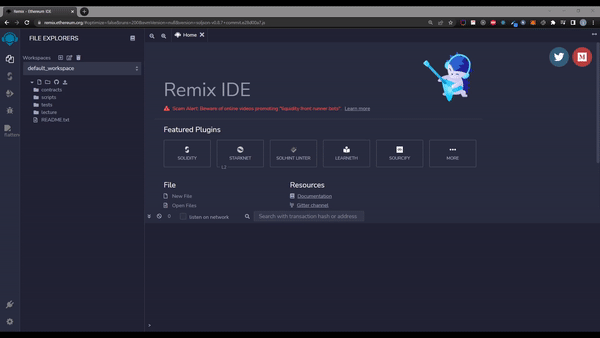
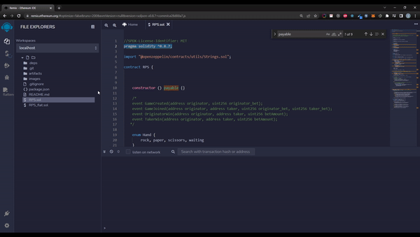
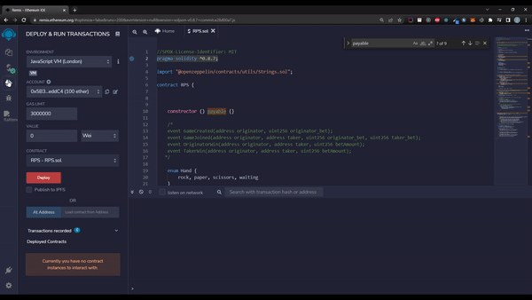
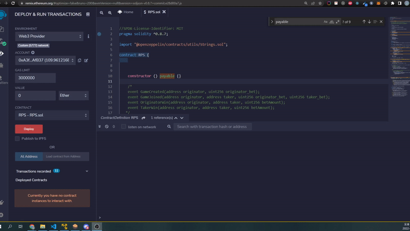
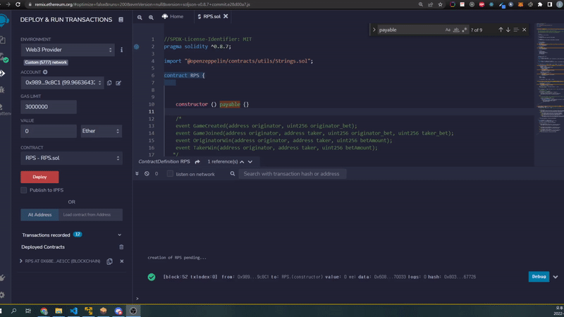
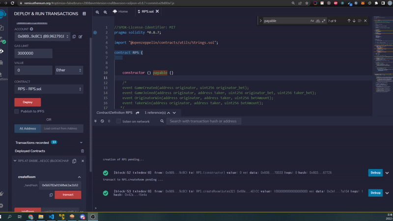
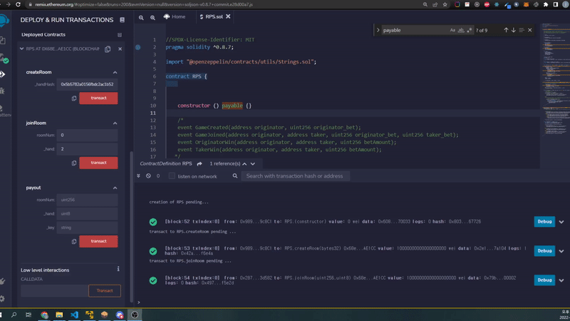

# 가위 바위 보 with Eth

## 가위바위보 게임을 ropsten위에 올려서 만들어 볼 예정이다.

1. 가위바위보 방생성자(originator)가 createRoom()을 할 때 본인의 패를 숨길 수 있어야 한다.
   -  createRoom() 인자로 Keccak-256로 암호화된 hand+_key 값(string)을 받는다.
   -  hand 는 enum으로 0~2 이며 순서대로 바위 보 가위 이다.
   -  ex) 0secretKey
3. originator가 이미 패를 숨겨서 냈기 때문에 참여자(taker)는 패를 숨기지 않아도 된다.
4. 하루안에 originator가 payout()를 사용하면 결과대로 돈을 반환한다.
   - payout 인자로 originator가 냈던 hand(uint8)와 _key(string) 값을 받는다.
5. 하루가 지나고 taker가 payout을 사용하면 taker가 돈을 가져간다.


## 과정 설명
[Github 전체 코드](https://github.com/jsc7727/RPS_Eth)

## 메소드는 크게 3가지로 이루어져 있다.
### 1. createRoom : 방 생성 및 originator 객체 인자값으로 초기화
```javascript
function createRoom (bytes32 _handHash) public payable returns (uint roomNum) {
    rooms[roomLen] = Game({
        betAmount: msg.value,
        gameStatus: GameStatus.STATUS_NOT_STARTED,
        originator: OriginatorPlayer({
            handHash: _handHash,
            hand: Hand.waiting,
            addr: payable(msg.sender),
            playerStatus: PlayerStatus.STATUS_PENDING,
            playerBetAmount: msg.value
        }),
        createdTime: block.timestamp,
        taker: TakerPlayer({ // will change
            hand: Hand.rock,
            addr: payable(msg.sender),  
            playerStatus: PlayerStatus.STATUS_PENDING,
            playerBetAmount: 0
        })
    });
    roomNum = roomLen;
    roomLen = roomLen+1;
}
```
### 2. joinRoom : 상대방 입장 및 taker 객체 인자값으로 초기화
```javascript
function joinRoom(uint roomNum, Hand _hand) public payable isValidHand( _hand) {        
    rooms[roomNum].taker = TakerPlayer({
        hand: _hand,
        addr: payable(msg.sender),
        playerStatus: PlayerStatus.STATUS_PENDING,
        playerBetAmount: msg.value
    });
    rooms[roomNum].betAmount = rooms[roomNum].betAmount + msg.value;
}
```

### 3. payout : originator와 taker의 승패 결과에 따라 이더리움 지급
```javascript
    modifier beforePayout(uint roomNum, Hand _hand, string memory _key, address sender) {
        // **시간 계산**
        // 하루이내에 originator가 payout을 실행 할 경우 compareHands 함수로 승패를 결정
        // 하루가 지난 다음에는 실제 승패와 관련없이 taker가 돈을 가져간다.
        uint currentTime = block.timestamp;
        if (currentTime > rooms[roomNum].createdTime + (60*60*24)) {
            // 정산이 하루 지났을 때 항상 taker 승리
            rooms[roomNum].originator.playerStatus = PlayerStatus.STATUS_LOSE;
            rooms[roomNum].taker.playerStatus = PlayerStatus.STATUS_WIN;
            _;
        }
        else{
            // 입력된 인자로 hash값을 만들어서 OriginatorPlayer의 hash 값이랑 비교후 맞으면 
            //  OriginatorPlayer의 hand 에 _hand 값을 입력
            // 보낸 사람이 originator인지 확인
            if(sender == rooms[roomNum].originator.addr){
                uint8 hand = uint8(_hand);
                bytes32 answer = keccak256(abi.encodePacked(Strings.toString(hand), _key));
                if(answer == rooms[roomNum].originator.handHash){
                    rooms[roomNum].originator.hand = _hand;
                    compareHands(roomNum);
                    _;
                }
            }
        }
    }
```
```javascript
function payout(uint roomNum, Hand _hand, string memory _key) 
    public payable 
    isPlayer(roomNum, msg.sender) // room에 참여한 플레이어가 맞는지 확인
    beforePayout(roomNum, _hand,  _key, msg.sender) {  
        // _key값과 hand값을 포함한 hash 값이 createRoom일때 입력했던 hash와 동일한지 확인

        // 여기서 부터 아래는 승패에 따라 정산과정
        if (rooms[roomNum].originator.playerStatus == PlayerStatus.STATUS_TIE && rooms[roomNum].taker.playerStatus == PlayerStatus.STATUS_TIE) {
            rooms[roomNum].originator.addr.transfer(rooms[roomNum].originator.playerBetAmount);
            rooms[roomNum].taker.addr.transfer(rooms[roomNum].taker.playerBetAmount);
        } else {
            if (rooms[roomNum].originator.playerStatus == PlayerStatus.STATUS_WIN) {
                rooms[roomNum].originator.addr.transfer(rooms[roomNum].betAmount);
            } else if (rooms[roomNum].taker.playerStatus == PlayerStatus.STATUS_WIN) {
                rooms[roomNum].taker.addr.transfer(rooms[roomNum].betAmount);
            } else {
                rooms[roomNum].originator.addr.transfer(rooms[roomNum].originator.playerBetAmount);
                rooms[roomNum].taker.addr.transfer(rooms[roomNum].taker.playerBetAmount);
            }
        }
         rooms[roomNum].gameStatus = GameStatus.STATUS_COMPLETE;
    }
    
```

## 배포

1. 지갑준비 [metamask](https://metamask.io/)
2. git clone
    ```
    git clone git@github.com:jsc7727/RPS_Eth.git
    ```
3.  remixd 글로벌 설치
    ```
    npm install -g remixd
    ```
4. package.json => scripts => remixd 부분에 현재 폴더의 절대 경로 입력
   -  ex) "remixd":"remixd -s 절대경로/RPS --remix-ide https://remix.ethereum.org",
5. [ganache 설치](https://trufflesuite.com/ganache/index.html)
6. remixd 실행
    ```
    yarn remixd
    ```
7. [remix](https://remix.ethereum.org) 접속 후 아래 와 같이 따라한다.
   
8. 온라인 remix 페이지를 localhost와 연결해준다.
   
    

9.  solidity compiler로 컴파일 한다.

    

10. 가나슈 네트워크와 remix를 연결한다.

    

    이제 가나슈 네트워크에서 deploy와 debug까지 가능하다.

## 실행

1.  deploy 버튼을 눌러 배포한다.
   
    

2.  createRoom을 실행한다. originator가 0(주먹)으로 10Eth를 배팅한다.
    [keccak-256 online](https://emn178.github.io/online-tools/keccak_256.html)에서 데이터를 hash로 변환해 인자로 넣어준다.
    데이터는 0~2(hand) + key 로 입력하면 된다.  ex) 0secret 
   
    

3.  joinRoom을 실행한다. taker가 2(가위)로 10Eth를 배팅한다.
   
    

4.  payout을 실행한다.
    하루 지나기 전에는 originator만 payout을 실행 할 수 있다.

    originator가 payout 실행 시 originator(주먹)으로 taker(가위)를 이겼다.
    
    originator는 배팅한 코인인 20Eth를 받을 수 있다.
    


## 후기
[etherscan](https://ropsten.etherscan.io/tx/0xc85ea8e72507e6f4751e8d9296c1a5243b388221b44fb0fe5ee7eb58cefc8290)
ropsten 네트워크에 올리는 부분은 미처 영상을 찍지 못했다.

해당 영상도 같이 올리면 좋았을텐데 하는 아쉬움이 남는다.

기능적인 면에서 배팅금액도 일치해야만 동작하게 했으면 더 좋았을 텐데 아쉽다.

만약 originator가 배팅을 하고 taker가 오지 않는다면 반환하는 기능도 필요하다.

조만간 시간내서 고쳐보도록 해야겠다.


    
